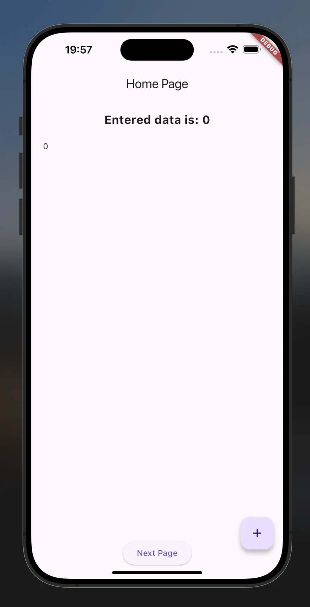
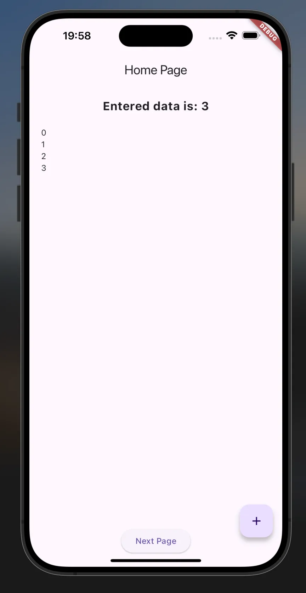
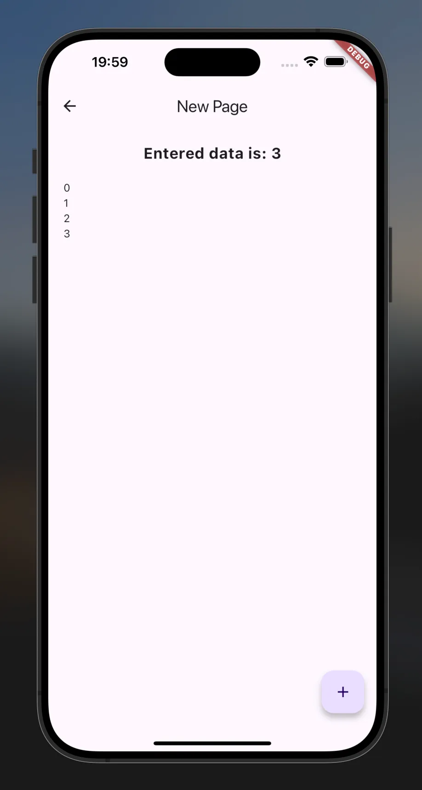
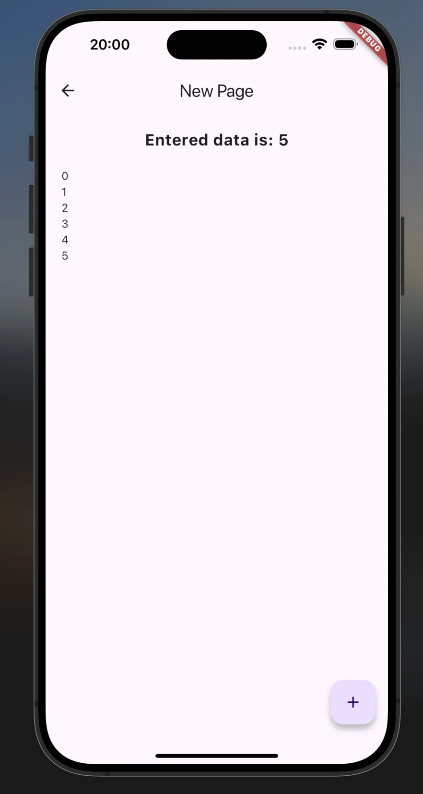
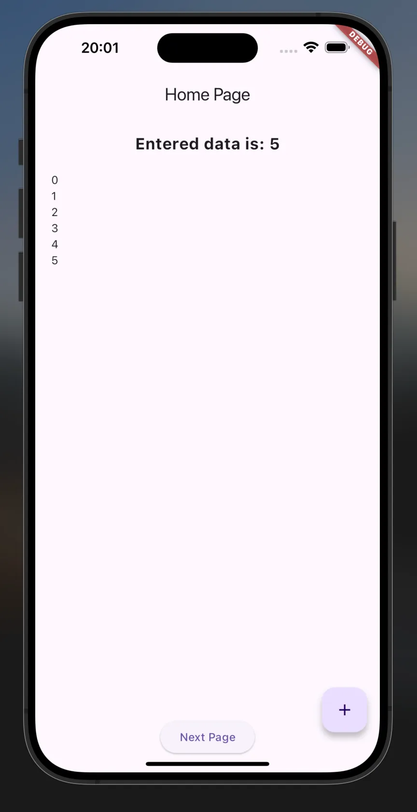

# Flutter State Management: Providers

This Flutter project demonstrates state management using the `Provider` package. The application features a simple counter that increments values and displays them across two pages, using a shared state managed by `ChangeNotifier`.

## Project Structure

- **`main.dart`**: Entry point of the application. Sets up `Provider` with `NumbersProvider` to manage and provide state across the widget tree.
- **`home.dart`**: The home page of the application. Displays a list of numbers and includes a button to navigate to the `NewPage`.
- **`new_page.dart`**: A secondary page that also displays the list of numbers and allows the user to add new numbers.
- **`numbers_provider.dart`**: Contains the `NumbersProvider` class which extends `ChangeNotifier` to manage the list of numbers and notify listeners of changes.

## Features

- **Shared State**: Uses `Provider` to manage and share state across multiple pages.
- **List Management**: Adds numbers to a list and displays the updated list in real-time.
- **Navigation**: Allows navigation between the `Home` page and the `NewPage` using Flutter's navigation system.

## How It Works

1. **State Management**:

   - `NumbersProvider` maintains a list of integers and provides an `add()` method to update the list.
   - The `notifyListeners()` method in `NumbersProvider` ensures that any changes to the list are reflected in the UI.

2. **UI Update**:

   - Both `Home` and `NewPage` use `Consumer<NumbersProvider>` to listen for state changes and rebuild their UI accordingly.
   - The `FloatingActionButton` on both pages allows users to increment the number in the shared list.

3. **Navigation**:
   - The `Home` page includes a button to navigate to the `NewPage`.
   - The `NewPage` features a back button to return to the `Home` page.

## Screenshots

## Demo video:

[Video](https://drive.google.com/file/d/1dxoZw11r-5i9ENCE1eMCGAEDBI_K4amB/view?usp=sharing)
